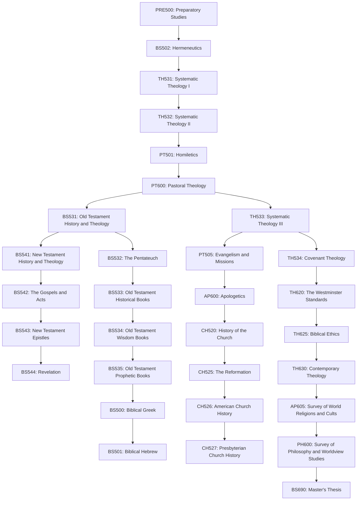

# Course Order

## Order I will take

```mermaid
graph TD
  PRE500[PRE500: Preparatory Studies]
  BS502[BS502: Hermeneutics]
  TH531[TH531: Systematic Theology I]
  TH532[TH532: Systematic Theology II]
  PT501[PT501: Homiletics]
  PT600[PT600: Pastoral Theology]
  BS531[BS531: Old Testament History and Theology]
  BS541[BS541: New Testament History and Theology]
  BS532[BS532: The Pentateuch]
  BS533[BS533: Old Testament Historical Books]
  BS534[BS534: Old Testament Wisdom Books]
  BS535[BS535: Old Testament Prophetic Books]
  BS542[BS542: The Gospels and Acts]
  BS543[BS543: New Testament Epistles]
  BS544[BS544: Revelation]
  TH533[TH533: Systematic Theology III]
  PT505[PT505: Evangelism and Missions]
  AP600[AP600: Apologetics]
  CH520[CH520: History of the Church]
  CH525[CH525: The Reformation]
  CH526[CH526: American Church History]
  CH527[CH527: Presbyterian Church History]
  TH534[TH534: Covenant Theology]
  TH620[TH620: The Westminster Standards]
  TH625[TH625: Biblical Ethics]
  TH630[TH630: Contemporary Theology]
  BS500[BS500: Biblical Greek]
  BS501[BS501: Biblical Hebrew]
  AP605[AP605: Survey of World Religions and Cults]
  PH600[PH600: Survey of Philosophy and Worldview Studies]
  BS690[BS690: Master's Thesis]

  PRE500 --> BS502
  BS502 --> TH531
  TH531 --> TH532
  TH532 --> PT501
  PT501 --> PT600
  PT600 --> BS531
  BS531 --> BS541
  BS531 --> BS532
  BS532 --> BS533
  BS533 --> BS534
  BS534 --> BS535
  BS541 --> BS542
  BS542 --> BS543
  BS543 --> BS544
  PT600 --> TH533
  TH533 --> PT505
  PT505 --> AP600
  AP600 --> CH520
  CH520 --> CH525
  CH525 --> CH526
  CH526 --> CH527
  TH533 --> TH534
  TH534 --> TH620
  TH620 --> TH625
  TH625 --> TH630
  BS535 --> BS500
  BS500 --> BS501
  TH630 --> AP605
  AP605 --> PH600
  PH600 --> BS690
  BS690
```

### Topological Sort

```mermaid
graph TD
  PRE500[PRE500: Preparatory Studies] --> BS502[BS502: Hermeneutics] --> TH531[TH531: Systematic Theology I] --> TH532[TH532: Systematic Theology II] --> PT501[PT501: Homiletics] --> PT600[PT600: Pastoral Theology] --> BS531[BS531: Old Testament History and Theology] --> BS541[BS541: New Testament History and Theology] --> BS532[BS532: The Pentateuch] --> BS533[BS533: Old Testament Historical Books] --> BS534[BS534: Old Testament Wisdom Books] --> BS535[BS535: Old Testament Prophetic Books] --> BS542[BS542: The Gospels and Acts] --> BS543[BS543: New Testament Epistles] --> BS544[BS544: Revelation] --> TH533[TH533: Systematic Theology III] --> PT505[PT505: Evangelism and Missions] --> AP600[AP600: Apologetics] --> CH520[CH520: History of the Church] --> CH525[CH525: The Reformation] --> CH526[CH526: American Church History] --> CH527[CH527: Presbyterian Church History] --> TH534[TH534: Covenant Theology] --> TH620[TH620: The Westminster Standards] --> TH625[TH625: Biblical Ethics] --> TH630[TH630: Contemporary Theology] --> BS500[BS500: Biblical Greek] --> BS501[BS501: Biblical Hebrew] --> AP605[AP605: Survey of World Religions and Cults] --> PH600[PH600: Survey of Philosophy and Worldview Studies] --> BS690[BS690: Master's Thesis]
```

## Dependency Order

```mermaid
graph TD
  PRE500[PRE500: Preparatory Studies]
  BS500[BS500: Biblical Greek]
  BS501[BS501: Biblical Hebrew]
  BS502[BS502: Hermeneutics]
  BS531[BS531: Old Testament History and Theology]
  BS532[BS532: The Pentateuch]
  BS533[BS533: Old Testament Historical Books]
  BS534[BS534: Old Testament Wisdom Books]
  BS535[BS535: Old Testament Prophetic Books]
  BS541[BS541: New Testament History and Theology]
  BS542[BS542: The Gospels and Acts]
  BS543[BS543: New Testament Epistles]
  BS544[BS544: Revelation]
  TH531[TH531: Systematic Theology I]
  TH532[TH532: Systematic Theology II]
  TH533[TH533: Systematic Theology III]
  TH534[TH534: Covenant Theology]
  TH620[TH620: The Westminster Standards]
  CH520[CH520: History of the Church]
  CH525[CH525: The Reformation]
  CH526[CH526: American Church History]
  CH527[CH527: Presbyterian Church History]
  PT501[PT501: Homiletics]
  PT505[PT505: Evangelism and Missions]
  AP600[AP600: Apologetics]
  AP605[AP605: Survey of World Religions and Cults]
  PH600[PH600: Survey of Philosophy and Worldview Studies]
  TH625[TH625: Biblical Ethics]
  TH630[TH630: Contemporary Theology]
  PT600[PT600: Pastoral Theology]
  BS690[BS690: Master's Thesis]

  PRE500 --> BS500
  PRE500 --> BS501
  PRE500 --> BS502
  PRE500 --> TH531
  PRE500 --> CH520
  PRE500 --> PT501
  PRE500 --> PT505
  PRE500 --> AP600
  PRE500 --> AP605
  PRE500 --> PH600

  BS502 --> BS531
  BS531 --> BS532
  BS531 --> BS533
  BS531 --> BS534
  BS531 --> BS535

  BS502 --> BS541
  BS541 --> BS542
  BS541 --> BS543
  BS541 --> BS544

  TH531 --> TH532
  TH532 --> TH533
  TH533 --> TH534
  TH533 --> TH620
  TH533 --> TH625
  TH533 --> TH630

  CH520 --> CH525
  CH520 --> CH526
  CH520 --> CH527

  PT501 --> PT600

  BS690 -->|"Requires all major coursework"| BS690
```

### Topological Sort

```mermaid
graph TD
  PRE500[PRE500: Preparatory Studies]
  BS500[BS500: Biblical Greek]
  BS501[BS501: Biblical Hebrew]
  BS502[BS502: Hermeneutics]
  BS531[BS531: Old Testament History and Theology]
  BS532[BS532: The Pentateuch]
  BS533[BS533: Old Testament Historical Books]
  BS534[BS534: Old Testament Wisdom Books]
  BS535[BS535: Old Testament Prophetic Books]
  BS541[BS541: New Testament History and Theology]
  BS542[BS542: The Gospels and Acts]
  BS543[BS543: New Testament Epistles]
  BS544[BS544: Revelation]
  TH531[TH531: Systematic Theology I]
  TH532[TH532: Systematic Theology II]
  TH533[TH533: Systematic Theology III]
  TH534[TH534: Covenant Theology]
  TH620[TH620: The Westminster Standards]
  CH520[CH520: History of the Church]
  CH525[CH525: The Reformation]
  CH526[CH526: American Church History]
  CH527[CH527: Presbyterian Church History]
  PT501[PT501: Homiletics]
  PT505[PT505: Evangelism and Missions]
  AP600[AP600: Apologetics]
  AP605[AP605: Survey of World Religions and Cults]
  PH600[PH600: Survey of Philosophy and Worldview Studies]
  TH625[TH625: Biblical Ethics]
  TH630[TH630: Contemporary Theology]
  PT600[PT600: Pastoral Theology]
  BS690[BS690: Master's Thesis]

  PRE500 --> BS502
  BS502 --> BS531
  BS531 --> BS532
  BS532 --> BS533
  BS533 --> BS534
  BS534 --> BS535
  BS535 --> BS541
  BS541 --> BS542
  BS542 --> BS543
  BS543 --> BS544
  BS544 --> BS500
  BS500 --> BS501
  BS501 --> TH531
  TH531 --> TH532
  TH532 --> TH533
  TH533 --> TH534
  TH534 --> TH620
  TH620 --> TH625
  TH625 --> TH630
  TH630 --> CH520
  CH520 --> CH525
  CH525 --> CH526
  CH526 --> CH527
  CH527 --> PT501
  PT501 --> PT600
  PT600 --> PT505
  PT505 --> AP600
  AP600 --> AP605
  AP605 --> PH600
  PH600 --> BS690
  BS690
```
