# Course Order

## Actual Order

```mermaid
graph TD
  PRE500[PRE500: preparatory studies]
  BS500[BS500: biblical greek]
  BS501[BS501: biblical hebrew]
  BS502[BS502: hermeneutics]
  BS531[BS531: old testament history and theology]
  BS532[BS532: the pentateuch]
  BS533[BS533: old testament historical books]
  BS534[BS534: old testament wisdom books]
  BS535[BS535: old testament prophetic books]
  BS541[BS541: new testament history and theology]
  BS542[BS542: the gospels and acts]
  BS543[BS543: new testament epistles]
  BS544[BS544: revelation]
  TH531[TH531: systematic theology i]
  TH532[TH532: systematic theology ii]
  TH533[TH533: systematic theology iii]
  TH534[TH534: covenant theology]
  TH620[TH620: the westminster standards]
  CH520[CH520: history of the church]
  CH525[CH525: the reformation]
  CH526[CH526: american church history]
  CH527[CH527: presbyterian church history]
  PT501[PT501: homiletics]
  PT505[PT505: evangelism and missions]
  AP600[AP600: apologetics]
  AP605[AP605: survey of world religions and cults]
  PH600[PH600: survey of philosophy and worldview studies]
  TH625[TH625: biblical ethics]
  TH630[TH630: contemporary theology]
  PT600[PT600: pastoral theology]
  BS690[BS690: master's thesis]

  PRE500 --> TH531
  PRE500 --> BS500
  TH531  --> TH534
  TH534  --> BS502
  BS502  --> PT501
  BS500  --> BS501
  BS501  --> PT501
```

## Semantic Order (one that should strictly precede another)

```mermaid
graph TD
  PRE500[PRE500: preparatory studies]
  BS500[BS500: biblical greek]
  BS501[BS501: biblical hebrew]
  BS502[BS502: hermeneutics]
  BS531[BS531: old testament history and theology]
  BS532[BS532: the pentateuch]
  BS533[BS533: old testament historical books]
  BS534[BS534: old testament wisdom books]
  BS535[BS535: old testament prophetic books]
  BS541[BS541: new testament history and theology]
  BS542[BS542: the gospels and acts]
  BS543[BS543: new testament epistles]
  BS544[BS544: revelation]
  TH531[TH531: systematic theology i]
  TH532[TH532: systematic theology ii]
  TH533[TH533: systematic theology iii]
  TH534[TH534: covenant theology]
  TH620[TH620: the westminster standards]
  CH520[CH520: history of the church]
  CH525[CH525: the reformation]
  CH526[CH526: american church history]
  CH527[CH527: presbyterian church history]
  PT501[PT501: homiletics]
  PT505[PT505: evangelism and missions]
  AP600[AP600: apologetics]
  AP605[AP605: survey of world religions and cults]
  PH600[PH600: survey of philosophy and worldview studies]
  TH625[TH625: biblical ethics]
  TH630[TH630: contemporary theology]
  PT600[PT600: pastoral theology]
  BS690[BS690: master's thesis]

  PRE500 --> BS500
  PRE500 --> BS501
  PRE500 --> BS502
  PRE500 --> TH531
  PRE500 --> CH520
  PRE500 --> PT501
  PRE500 --> PT505
  PRE500 --> AP600
  PRE500 --> AP605
  PRE500 --> PH600

  BS502 --> BS531
  BS531 --> BS532
  BS531 --> BS533
  BS531 --> BS534
  BS531 --> BS535

  BS502 --> BS541
  BS541 --> BS542
  BS541 --> BS543
  BS541 --> BS544

  TH531 --> TH532
  TH532 --> TH533
  TH533 --> TH534
  TH533 --> TH620
  TH533 --> TH625
  TH533 --> TH630

  CH520 --> CH525
  CH520 --> CH526
  CH520 --> CH527

  PT501 --> PT600

  BS690 -->|"Requires all major coursework"| BS690
```

  <!--
  TH532[TH532: systematic theology ii]
  TH533[TH533: systematic theology iii]
  TH620[TH620: the westminster standards]
  BS531[BS531: old testament history and theology]
  BS532[BS532: the pentateuch]
  BS533[BS533: old testament historical books]
  BS534[BS534: old testament wisdom books]
  BS535[BS535: old testament prophetic books]
  BS541[BS541: new testament history and theology]
  BS542[BS542: the gospels and acts]
  BS543[BS543: new testament epistles]
  BS544[BS544: revelation]
  CH520[CH520: history of the church]
  CH525[CH525: the reformation]
  CH526[CH526: american church history]
  CH527[CH527: presbyterian church history]
  TH625[TH625: biblical ethics]
  AP600[AP600: apologetics]
  PH600[PH600: survey of philosophy and worldview studies]
  PT505[PT505: evangelism and missions]
  AP605[AP605: survey of world religions and cults]
  TH630[TH630: contemporary theology]
  PT600[PT600: pastoral theology]
  BS690[BS690: master's thesis]
-->
